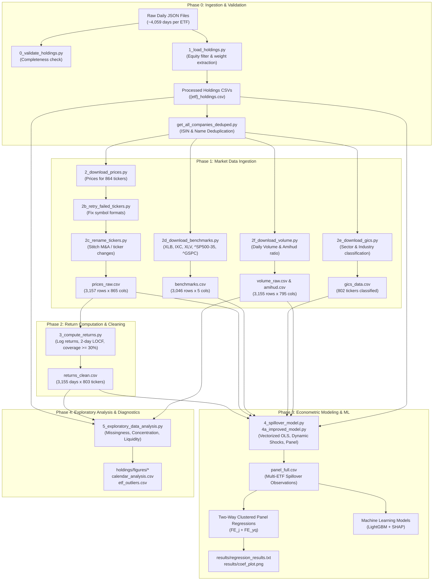

# System Architecture & Data Pipeline

> **Master's Thesis:** *Structural Dynamics and Contagion Mechanisms of Intra-ETF Shock Transmission*  
> **Workspace Path:** [`.`](.)  
> **Scripts Directory:** [`src`](./code)  
> **Target File:** [`architecture.md`](src/architecture.md)

---

## 1. High-Level Pipeline Flowchart

The system executes a modular sequential pipeline transforming unorganized daily JSON holding snapshots into a harmonized econometric panel ready for multi-way clustered fixed effects regressions and machine learning models.



---

## 2. Directory Structure

The project maintains separation between raw data, processed analytical tables, modeling outputs, and code:

```
.\
│
├── src\                                      # Executable Python scripts & markdown documentation
│   ├── context.md                             # Thesis overview and research question
│   ├── AGENTS.md                              # Instructions for AI agents and conventions
│   ├── methodology.md                         # Detailed econometric models and math
│   ├── architecture.md                        # This document (system design & data profiles)
│   ├── progress.md                            # Roadmap and phase changelog
│   ├── 0_validate_holdings.py                 # JSON count and date continuity verification
│   ├── 0_1_validation_duplicates.py          # Checks for intra-day ticker duplicates
│   ├── 1_load_holdings.py                     # Holdings JSON loader and cleaner
│   ├── 2_download_prices.py                   # Batched yfinance adjusted close downloader
│   ├── 2_1_missing_downloads.py              # Reports tickers missing after initial download
│   ├── 2b_retry_failed_tickers.py             # Format normalization retry script
│   ├── 2c_rename_tickers.py                   # Concatenates renamed/acquired ticker histories
│   ├── 2d_download_benchmarks.py              # Downloads sector index benchmarks
│   ├── 2e_download_gics.py                    # Fetches GICS sector/industry classifications
│   ├── 2e_02_manually_adding_labels.py        # Fills missing classifications for historical tickers
│   ├── 2f_download_volume.py                  # Computes Amihud illiquidity from volume and returns
│   ├── 3_compute_returns.py                   # Computes log returns and aligns to calendar
│   ├── 4_spillover_model.py                   # Baseline vectorized spillover model
│   ├── 5_exploratory_data_analysis.py         # EDA, concentration tables, calendar analysis
│   ├── 5a_EDA_on_jsons.py                     # Direct raw JSON exploratory verification
│   ├── 5b_integrity_check.py                  # Field-level verification of processed files
│   ├── get_all_companies.py                   # Extracts unique firms from holdings
│   └── get_all_companies_deduped.py           # Deduplicates firms using ISIN / clean names
│
├── holdings\                                  # Primary Data Hub
│   ├── spy_holdings\                          # Daily raw JSON holdings snapshots for SPY
│   ├── xme_holdings\                          # Daily raw JSON holdings snapshots for XME
│   ├── xle_holdings\                          # Daily raw JSON holdings snapshots for XLE
│   ├── ihe_holdings\                          # Daily raw JSON holdings snapshots for IHE
│   ├── xlv_holdings\                          # Daily raw JSON holdings snapshots for XLV
│   │
│   ├── processed\                             # Clean, harmonized analysis-ready datasets
│   │   ├── all_companies.csv
│   │   ├── all_companies_deduped.csv
│   │   ├── all_companies_etf.csv
│   │   ├── amihud.csv                         # Rolling Amihud illiquidity ratios
│   │   ├── benchmark_coverage.csv             # Benchmark date ranges and data status
│   │   ├── benchmark_mapping.csv              # Mapping of each ETF to designated benchmark
│   │   ├── benchmarks.csv                     # Historical benchmark adjusted close prices
│   │   ├── calendar_analysis.csv              # Breakdown of missing dates and LOCF impact
│   │   ├── download_report.csv                # Ticker download success/failure registry
│   │   ├── etf_outliers.csv                   # Top concentrated constituent weights per ETF
│   │   ├── gics_data.csv                      # GICS sector and industry labels
│   │   ├── ihe_holdings.csv                   # Ingested equity holdings for IHE
│   │   ├── prices_raw.csv                     # Raw price matrix (wide format)
│   │   ├── rename_report.csv                  # Log of stitched corporate action tickers
│   │   ├── returns_clean.csv                  # Clean log returns matrix (wide format)
│   │   ├── spy_holdings.csv                   # Ingested equity holdings for SPY
│   │   ├── ticker_coverage.csv                # Percentage of non-missing return days per ticker
│   │   ├── ticker_to_canonical.csv            # Mapping of raw symbols to clean canonical tickers
│   │   ├── volume_raw.csv                     # Daily trading volume matrix (wide format)
│   │   ├── xle_holdings.csv                   # Ingested equity holdings for XLE
│   │   ├── xlv_holdings.csv                   # Ingested equity holdings for XLV
│   │   └── xme_holdings.csv                   # Ingested equity holdings for XME
│   │
│   ├── results\                               # Regression logs, model panels, metrics
│   │   ├── panel_full.csv                     # Generated spillover regression panel
│   │   └── regression_results.txt             # Model estimates and summary tables
│   │
│   └── figures\                               # Publication-quality charts and thesis graphics
│       ├── weight_distribution.png
│       ├── returns_correlation.png
│       └── amihud_distribution.png
│
├── files\                                     # Reference PDFs, thesis guidelines, and documentation
├── tmp_context_extract\                       # Parsed text dumps and data dictionaries
└── requirements.txt                           # Python dependencies
```

---

## 3. Data File Profiles & Dimensions

Below is the verified structural profile of all key processed data files in [`holdings/processed/`](holdings/processed/):

| File Name | Row Count | Column Count | File Size (MB) | Temporal Scope | Primary Key / Index | Description |
| :--- | :--- | :--- | :--- | :--- | :--- | :--- |
| [`spy_holdings.csv`](holdings/processed/spy_holdings.csv) | 1,388,616 | 11 | 151.30 MB | 2015-01-02 – 2026-02-11 | `(atDate, symbol)` | Daily SPY equity holdings |
| [`xlv_holdings.csv`](holdings/processed/xlv_holdings.csv) | 170,818 | 11 | 18.44 MB | 2015-01-02 – 2026-02-11 | `(atDate, symbol)` | Daily XLV equity holdings |
| [`ihe_holdings.csv`](holdings/processed/ihe_holdings.csv) | 116,218 | 11 | 12.38 MB | 2015-01-02 – 2026-02-11 | `(atDate, symbol)` | Daily IHE equity holdings |
| [`xme_holdings.csv`](holdings/processed/xme_holdings.csv) | 82,555 | 11 | 9.03 MB | 2015-01-02 – 2026-02-11 | `(atDate, symbol)` | Daily XME equity holdings |
| [`xle_holdings.csv`](holdings/processed/xle_holdings.csv) | 78,911 | 11 | 8.52 MB | 2015-01-02 – 2026-02-11 | `(atDate, symbol)` | Daily XLE equity holdings |
| [`prices_raw.csv`](holdings/processed/prices_raw.csv) | 3,157 | 865 | 40.02 MB | 2014-01-02 – 2026-02-12 | `date` (Datetime) | Daily adjusted close prices |
| [`returns_clean.csv`](holdings/processed/returns_clean.csv) | 3,155 | 803 | 46.17 MB | 2014-01-03 – 2026-02-12 | `date` (Datetime) | Clean daily log returns ($\ge 30\%$ coverage) |
| [`amihud.csv`](holdings/processed/amihud.csv) | 3,155 | 795 | 49.53 MB | 2014-01-03 – 2026-02-12 | `date` (Datetime) | Rolling 20-day Amihud ratio |
| [`volume_raw.csv`](holdings/processed/volume_raw.csv) | 3,155 | 795 | 21.02 MB | 2014-01-03 – 2026-02-12 | `date` (Datetime) | Daily trading volume shares |
| [`benchmarks.csv`](holdings/processed/benchmarks.csv) | 3,046 | 5 | 0.24 MB | 2014-01-02 – 2026-02-11 | `date` (Datetime) | Benchmark prices (`^GSPC`, `XLB`, `IXC`, `XLV`, `^SP500-35`) |
| [`all_companies.csv`](holdings/processed/all_companies.csv) | 1,752 | 8 | 0.12 MB | Static | `symbol` | All unique constituent records |
| [`all_companies_deduped.csv`](holdings/processed/all_companies_deduped.csv) | 1,120 | 10 | 0.09 MB | Static | `canonical_symbol` | ISIN/Name deduplicated entities |
| [`gics_data.csv`](holdings/processed/gics_data.csv) | 802 | 6 | 0.06 MB | Static | `ticker` | GICS sector and industry metadata |
| [`ticker_coverage.csv`](holdings/processed/ticker_coverage.csv) | 802 | 2 | 0.01 MB | Static | `ticker` | Coverage ratio ($\ge 0.30$) |
| [`rename_report.csv`](holdings/processed/rename_report.csv) | 53 | 5 | 0.003 MB | Static | `old_ticker` | Corporate action stitching log |
| [`calendar_analysis.csv`](holdings/processed/calendar_analysis.csv) | 5 | 7 | 0.001 MB | 2015–2026 | `ETF` | Calendar completeness & LOCF summary |
| [`etf_outliers.csv`](holdings/processed/etf_outliers.csv) | 19 | 4 | 0.001 MB | As of 2026-02 | `(ETF, symbol)` | Heaviest constituent holdings |

---

## 4. Script Dependency Matrix

The table below outlines input requirements, operations, and outputs for all code scripts:

| Script | Inputs | Operations Performed | Output Artifacts |
| :--- | :--- | :--- | :--- |
| [`0_validate_holdings.py`](src/0_validate_holdings.py) | `holdings/*/*.json` | Asserts date continuity, counts raw files, detects format issues | Console validation report |
| [`0_1_validation_duplicates.py`](src/0_1_validation_duplicates.py) | `processed/{etf}_holdings.csv` | Scans for intra-day duplicates of the same ticker | Integrity report |
| [`1_load_holdings.py`](src/1_load_holdings.py) | `holdings/*/*.json` | Ingests JSON records; filters out bonds, cash, other funds; retains raw weights | `processed/{etf}_holdings.csv` |
| [`get_all_companies_deduped.py`](src/get_all_companies_deduped.py) | `processed/*_holdings.csv` | Groups tickers by ISIN and cleaned legal entity names | `processed/all_companies_deduped.csv`, `ticker_to_canonical.csv` |
| [`2_download_prices.py`](src/2_download_prices.py) | `processed/all_companies_deduped.csv` | Batched yfinance API calls (100 tickers/batch) for adjusted closing prices | `processed/prices_raw.csv`, `download_report.csv` |
| [`2b_retry_failed_tickers.py`](src/2b_retry_failed_tickers.py) | `processed/download_report.csv` | Retries failed downloads by stripping country suffixes (e.g., `.US`, ` US`) | Updates `prices_raw.csv` |
| [`2c_rename_tickers.py`](src/2c_rename_tickers.py) | `prices_raw.csv`, historical mapping | Chains historical tickers with successor tickers across acquisitions/rebrandings | `processed/rename_report.csv`, updates `prices_raw.csv` |
| [`2d_download_benchmarks.py`](src/2d_download_benchmarks.py) | Yahoo Finance API | Downloads `^GSPC`, `XLB`, `IXC`, `XLV`, `^SP500-35`, `VHT` from 2014-01-01 | `processed/benchmarks.csv`, `benchmark_coverage.csv` |
| [`2e_download_gics.py`](src/2e_download_gics.py) | `prices_raw.csv` tickers | Queries yfinance `Ticker.info` for GICS sector and industry classifications | `processed/gics_data.csv` |
| [`2f_download_volume.py`](src/2f_download_volume.py) | Constituent tickers | Downloads daily volume; computes 20-day rolling Amihud (2002) illiquidity ratio | `processed/volume_raw.csv`, `processed/amihud.csv` |
| [`3_compute_returns.py`](src/3_compute_returns.py) | `prices_raw.csv`, SPY calendar | Computes log returns; applies $\le 2$-day LOCF for minor holiday mismatches; drops tickers $<30\%$ coverage | `processed/returns_clean.csv`, `ticker_coverage.csv` |
| [`4_spillover_model.py`](src/4_spillover_model.py) | `returns_clean.csv`, `benchmarks.csv`, `amihud.csv`, `gics_data.csv` | Vectorized batch OLS; dynamic shock detection; builds $(j, e)$ panel; estimates OLS regression | `results/panel_full.csv`, `results/regression_results.txt`, `results/coef_plot.png` |
| [`5_exploratory_data_analysis.py`](src/5_exploratory_data_analysis.py) | `returns_clean.csv`, `amihud.csv`, holdings CSVs | Computes concentration outliers, calendar missingness, distribution diagnostics | `processed/calendar_analysis.csv`, `processed/etf_outliers.csv`, `figures/*.png` |

---

## 5. Algorithmic Optimization: Vectorized Shock Identification

To avoid computationally prohibitive Python loops when estimating rolling market models across 802 stocks over 3,155 trading days (over 2.5 million potential regressions), [`4_spillover_model.py`](src/4_spillover_model.py) implements a **vectorized batch OLS algorithm using strided arrays**:

1. **Strided Matrix Construction:** For each constituent stock $i$, window indices are extracted simultaneously using `np.lib.stride_tricks` to form a 3D batch tensor $\mathbf{X}_{\text{batch}} \in \mathbb{R}^{K \times W \times 2}$ and $\mathbf{Y}_{\text{batch}} \in \mathbb{R}^{K \times W}$, where $K$ is the number of eligible event dates and $W=120$.
2. **Batch Normal Equations via Einsum:**
   $$\mathbf{X}^\top \mathbf{X} = \text{np.einsum}('kij, kil \rightarrow kjl', \mathbf{X}_{\text{batch}}, \mathbf{X}_{\text{batch}})$$
   $$\mathbf{X}^\top \mathbf{Y} = \text{np.einsum}('kij, ki \rightarrow kj', \mathbf{X}_{\text{batch}}, \mathbf{Y}_{\text{batch}})$$
3. **Analytic $2 \times 2$ Cramer Matrix Inversion:** Closed-form determinants and cross-products compute thousands of $(\hat{\alpha}, \hat{\beta})$ parameter pairs in milliseconds without invoking general-purpose linear algebra solvers.
4. **Vectorized Residual Variance:** Residual standard errors $\hat{\sigma}_{\epsilon, i}(t_0)$ and cumulative abnormal returns $CAR_i(t_0)$ are calculated using tensor broadcasting, reducing execution time from over 6 hours to under 2 minutes per ETF.


